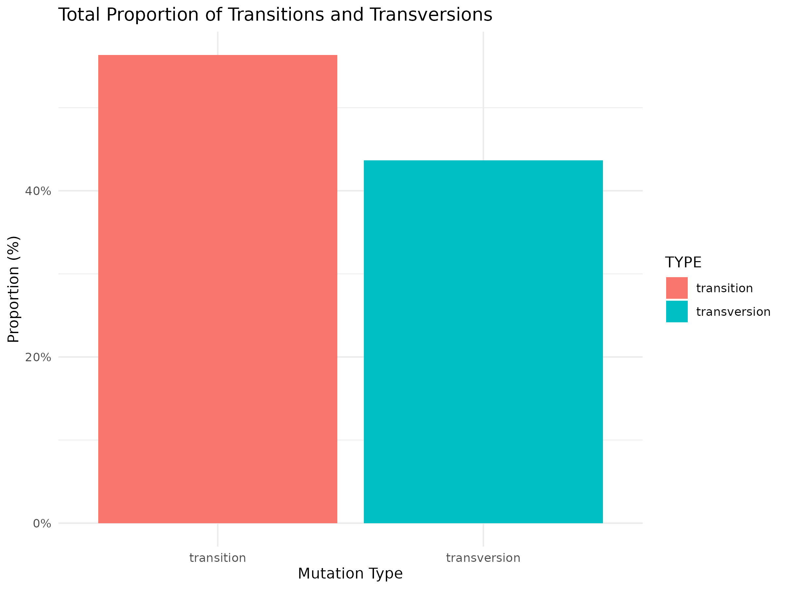
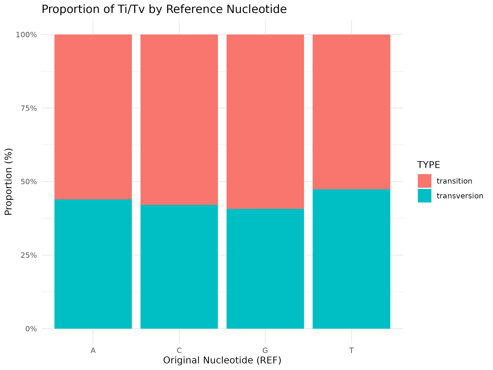

# Proportion of Transitions and Transversions in the *Luscinia* Genome in Total and by Type of Nucleotide

This project focuses on the analysis of the proportion of transitions (A ↔ G, C ↔ T) and transversions (A ↔ C/T, C ↔ A/G, G ↔ C/T, T ↔ A/G) both in total and categorized by individual reference nucleotides.

## Input Data
The input data consists of a VCF file containing variants of the *Luscinia* genome, accessed from the shared directory:  
`/data-shared/vcf_examples/luscinia_vars.vcf.gz`

## Workflow.sh
The executable shell script `workflow.sh` processes the raw genomic data in several steps:
* **zcat & grep**: Decompresses the VCF file and filters out headers and INDEL variants to keep only Single Nucleotide Polymorphisms (SNPs).
* **awk '{print $4, $5}'**: Extracts the reference (REF) and alternative (ALT) alleles.
* **sed**: Handles multi-allelic sites by splitting them into multiple lines, ensuring each substitution is counted as a unique event.
* **awk classification**: Applies logic to categorize each SNP as a "transition" or "transversion" based on the biochemical properties of the nucleotides.
* **Redirection**: Saves the final structured data into `results/substitution_type.tsv` for downstream analysis.

## Analysis in R
The `data-analysis.R` script utilizes the `tidyverse` suite (specifically `ggplot2`, `dplyr`, and `readr`) to visualize the mutation spectrum:
* **Data Transformation**: The script calculates the relative frequencies (proportions) of each mutation type.
* **Visualization**: It generates two distinct plots to provide a comprehensive view of the substitution bias.
* The script is executed automatically at the end of the shell workflow.

## Results
The final results of the analysis are stored in the `results/` directory.

### Total Proportions
**Figure 1: Total Proportion of Transitions and Transversions** This plot displays the global ratio of Ti vs. Tv. Transitions are occuring at a higher frequency in the given dataset.

### Proportions by Nucleotide
**Figure 2: Proportion of Ti/Tv by Reference Nucleotide** This plot displays the mutation types based on the original nucleotide (A, C, G, T). Most transversions were observed in sites containing thymine.

### Note
Both scripts (R and shell script) were finalized with the help of Gemini (AI).
